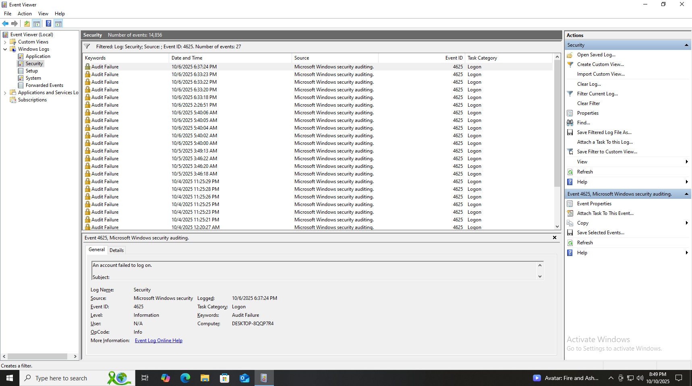
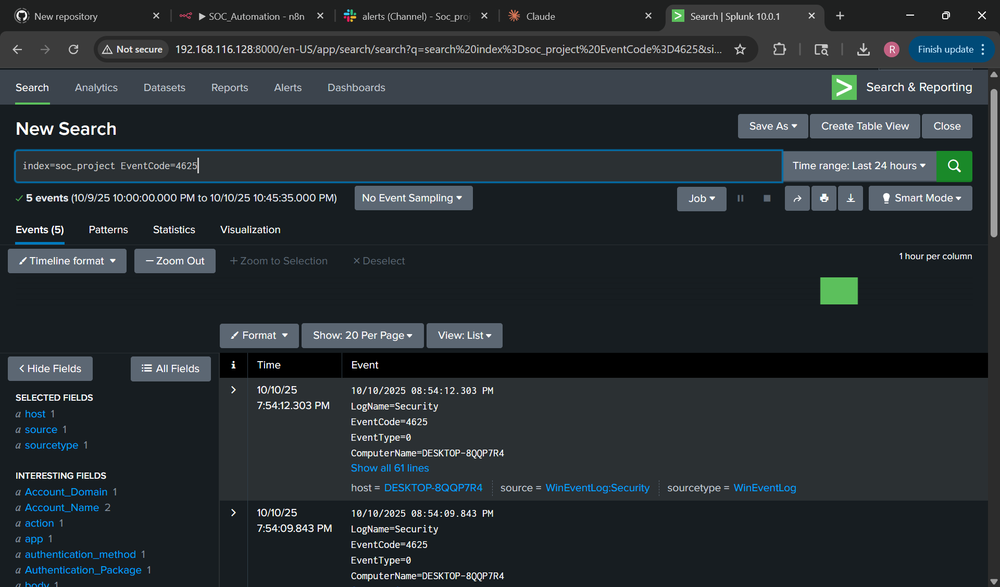
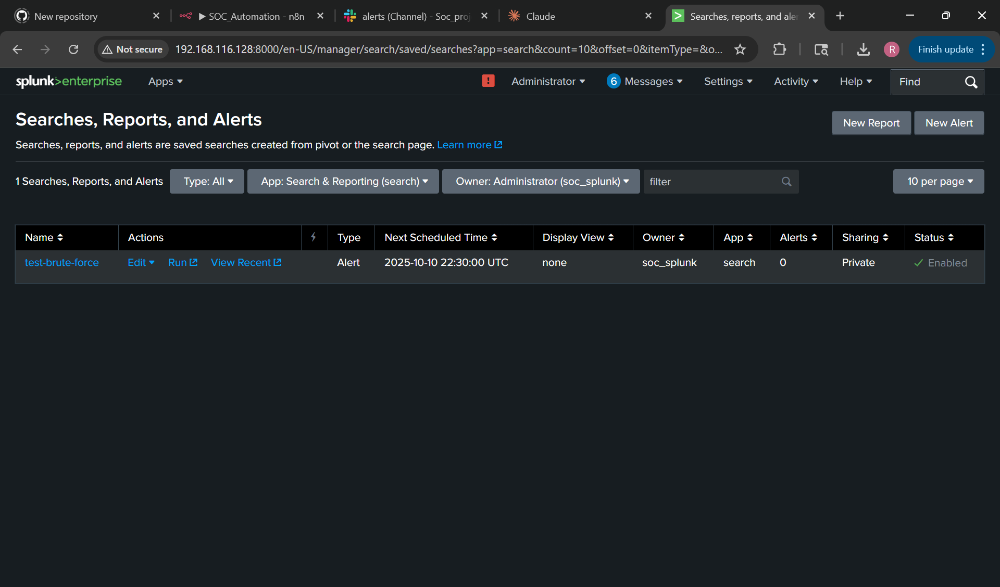
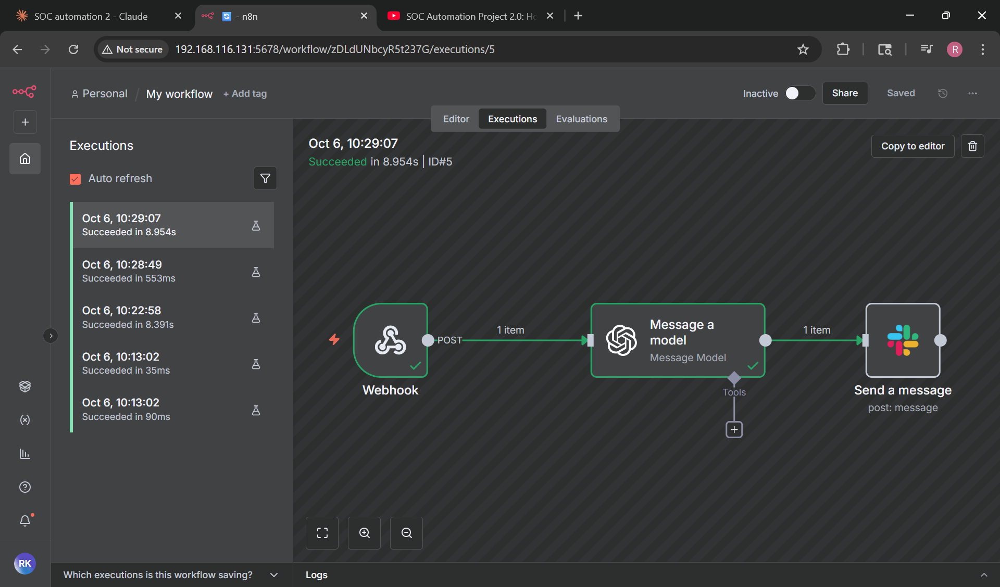
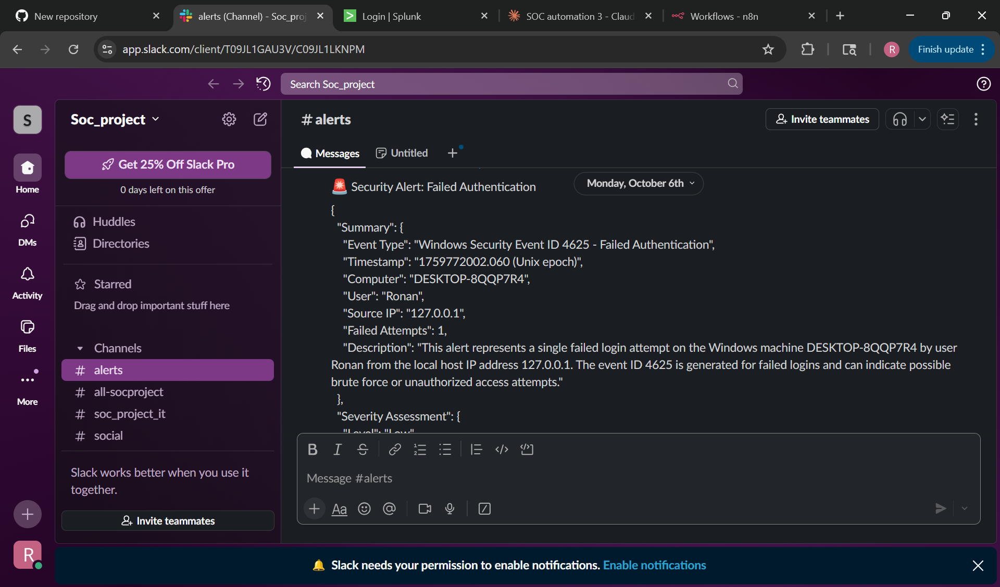
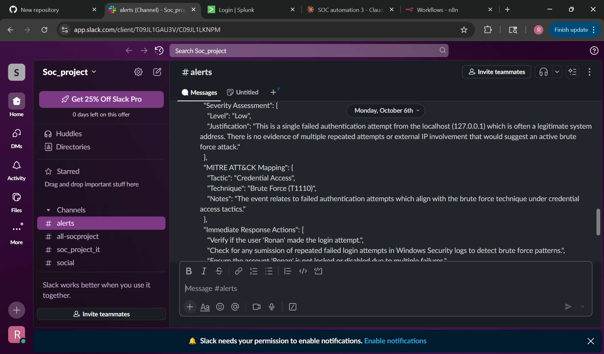

# Audit Evidence — Exhibits A through F

This folder contains the six audit evidence exhibits supporting the control assessments in the SOC 2 Type I Audit Report. Each screenshot was captured from the live SOC Automation Lab environment during the audit period.

---

## Exhibit A — Windows Event Viewer: Event ID 4625

**SOC 2 control:** CC6.7 — Logical Access Controls

Windows Event Viewer on DESKTOP-8QQP7R4 filtered for Event ID 4625, showing 27 audit failure (failed logon) events logged between October 4–6, 2025. Confirms EventID=4625, Keywords=Audit Failure, TaskCategory=Logon. This is the event source that feeds the entire detection pipeline.

---

## Exhibit B — Splunk Search: EventCode=4625 Detection

**SOC 2 control:** CC7.2 — System Monitoring

Splunk Enterprise (192.168.116.128) executing SPL query `index=soc_project EventCode=4625`, returning 5 events within the 24-hour window. Confirms the SIEM is ingesting Windows Security logs and correctly filtering on failed authentication indicators.

---

## Exhibit C — Splunk Alert Configuration: test-brute-force

**SOC 2 control:** CC7.2 — Automated Alerting

Splunk Searches, Reports, and Alerts panel showing the "test-brute-force" alert configured, enabled, and scheduled. Status shows ✓ Enabled. Demonstrates a documented, operational monitoring control.

---

## Exhibit D — n8n Workflow Executions: 5/5 Successful

**SOC 2 control:** A1.2 — System Availability

n8n workflow execution log showing 5 consecutive successful executions on October 6, 2025. Processing times range from 35ms to 8.954s. Confirms three-node pipeline: Webhook → OpenAI GPT-4 → Slack operating reliably.

---

## Exhibit E — Slack Alert Delivery: #alerts Channel

**SOC 2 control:** CC7.3 — Incident Response Notification

Slack #alerts channel showing an AI-generated security alert delivered on October 6th with Event Type, Timestamp, Computer, User, Source IP, and Failed Attempts count. Confirms end-to-end notification delivery.

---

## Exhibit F — MITRE ATT&CK Mapping and Response Actions

**SOC 2 control:** CC7.3 — AI-Enriched Threat Intelligence

GPT-4 enrichment output showing Severity Assessment (Low), MITRE ATT&CK Mapping (Tactic: Credential Access, Technique: Brute Force T1110), and Immediate Response Actions. Demonstrates automated threat intelligence and structured incident response guidance.

---

## Evidence Chain

| Step | Exhibit | What it proves |
|---|---|---|
| 1 | A | Events generated and logged on Windows source |
| 2 | B | Splunk ingesting and querying events |
| 3 | C | Automated alert rule configured and active |
| 4 | D | n8n automation pipeline executing reliably |
| 5 | E | Alerts delivered to Slack successfully |
| 6 | F | GPT-4 enriching alerts with MITRE mapping |

---

*Referenced in the [SOC2 Audit Report](../SOC2_Audit_Report.docx) and [SOC2 Audit Evidence Appendix](../SOC2_Audit_Evidence_Appendix.docx).*
